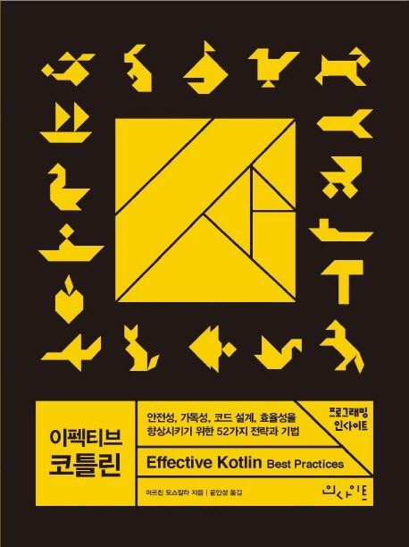

### 코틀린 좋아하세요?

- 혹시 코틀린 좋아하세요?
- 우린 4주간 코틀린과 친해져보기 위해 이펙티브 코틀린을 독서할 예정입니다.

### 📚 Member
  

|  |  |  |  |  |
| :----------------------------------------------------------: | :----------------------------------------------------------: | :----------------------------------------------------------: | :----------------------------------------------------------: | :----------------------------------------------------------: |
|          [👑김진욱(대장)](https://github.com/NownS)           |           [김성민](https://github.com/devsungmin)            |             [박세란](https://github.com/sery270)             |            [이재경](https://github.com/jklee103)             |            [임지민](https://github.com/jimin3263)            |

  

### 우리의 미션

[모임 이전]

- 책을 모임 직전에 몰아서 읽는 것을 방지하기 위해 정기적으로 함께 읽는 시간을 마련한다. ([1-1_flc](https://github.com/sipe-team/1-1_flc) ) 와 함께 진행
  - 평일 주 2회 1시간 이상 진행한다.
  - 온라인, 오프라인, 참여 유무는 자율에 맡긴다.
- 책을 읽고 각자 중요하다고 생각한 부분을 정리하여 PR을 올린다.

[모임 진행]

- 당일 랜덤하게 진행자 2명을 결정한다. (매주 2장 진행, 각 진행자는 1장씩 진행)
- 진행자는 정리한 내용을 청자들에게 설명한다.
- 진행자는 핵심 내용에 대한 질문을 청자에게 질문한다. (optional)
- 청자들은 본인이 이야기하고 싶었던 내용들을 공유한다.

[모임 이후]

- 모임 진행한 내용을 최종 정리하여 기존에 올렸던 파일에 최종 수정하여 PR을 올린다. (요약, 오갔던 이야기 등등)

### 예상 아웃풋

- 이펙티브 코틀린을 완독하고, 코틀린과 친해진다.
